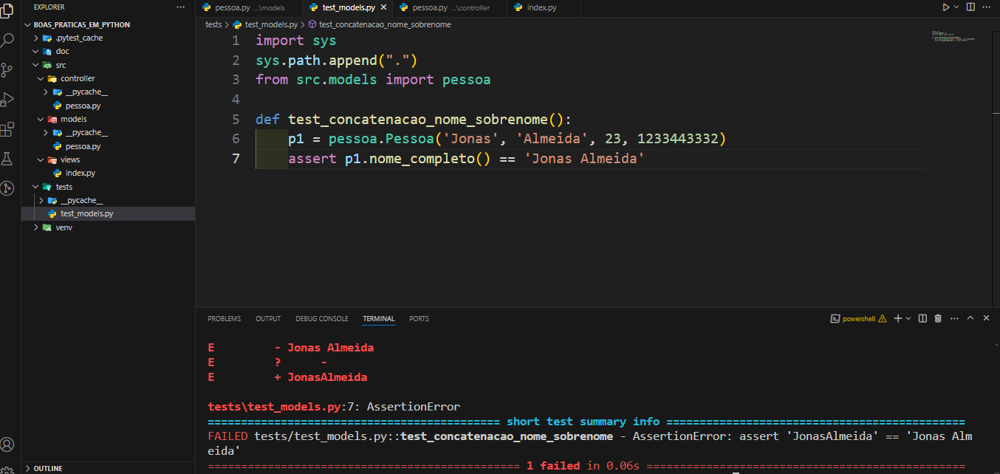
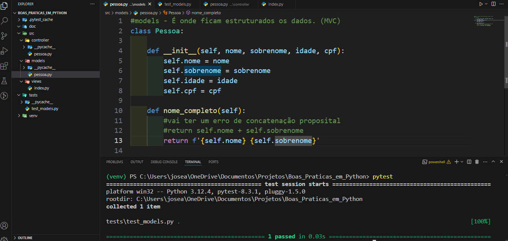

# Boas Práticas em Python

Este repositório demonstra a implementação de boas práticas em Python usando o padrão arquitetural MVC (Model-View-Controller). O objetivo é apresentar uma estrutura organizada e de fácil manutenção para projetos Python.

## Estrutura do Projeto

O projeto está organizado nas seguintes pastas e arquivos principais:

```sh
Boas_Praticas_em_Python/

├── doc
├── src/
│ ├── views/
│ │     └── index.py
│ ├── controller/
│ │     └── pessoa.py
│ └── models/
│       └── pessoa.py
└── tests/
│   └── test_models.py
└── venv
```
### Modelos (Models)

Os modelos são responsáveis pela estrutura dos dados. No arquivo `pessoa.py` localizado em `src/models/`, temos a classe `Pessoa` que define os atributos de uma pessoa.

### Controladores (Controllers)

Os controladores contêm a lógica dos dados nos modelos. No arquivo `pessoa.py` localizado em `src/controller/`, temos a classe `PessoaController` que gerencia a lógica de salvar e listar pessoas.

### Visões (Views)
As visões são onde temos as interações com o usuário, seja através de uma interface gráfica ou de linha de comando. No arquivo `index.py` localizado em `src/views/`, interagimos com o usuário para salvar ou listar pessoas.

### Testes (Tests)
Os testes são essenciais para garantir que o código funcione conforme o esperado. No arquivo `test_models.py` localizado em `tests/`, temos um teste simples para verificar a concatenação do nome e sobrenome.

## Executando o Projeto

Para executar o projeto, siga os passos abaixo:

- Certifique-se de que o ambiente virtual esteja ativado.
- Navegue até o diretório raiz do projeto.
- Execute o script `index.py`:

```sh
  python -m src.views.index
```

### Testes

- Para rodar os testes, use o pytest:

```sh
    pytest tests/test_models.py
```


